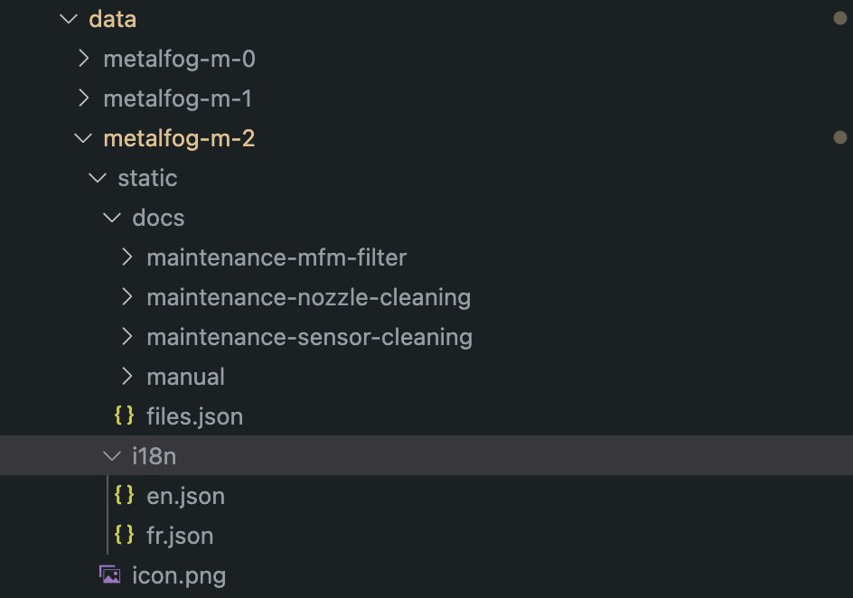

# @nuster/turbine 💨

Handle complex machines cycles with ease using turbine.

this project manages:

* Profiles
* Cycles
* Passives regulations
* Preventive maintenances tasks
* Manual & Advanced IO Management

## Data management 🗂️

To handle machine specifications and `info.json` file is required at the `/data` folder (local to project when `NODE_ENV` is not set to production).

### Machine configurations

You can create as many machine configuration you want. They will all be available in the configuration screen available in `@nuster/ui` at `/configure` for unconfigured machines and `/settings/edit` for already configured machines.

Each machine configuration must be in `/data/machine` in it's own folder such as `my-machine-1`.

The folder structure must be set like this:

* `specs.json` a JSON file which conforms to the `@nuster/turbine/build/types/schemas/schema-specs.json` schema.
  * `static` a folder that will be served by `turbine`
    * `i18n` a folder that contains all translation files which conforms to the `@nuster/turbine/build/types/schemas/schema-translations.json` schema.
    * `docs` a folder that contains docs served by the `Help` page in `@nuster/ui` and preventive maintenance tasks in `Maintenance` page.
      * `files.json` describes help files, conforms to `DocFile[]` from `@nuster/turbine/types/docs`.
    * `icon.png` a png file which will be displayed in the `Help` page as the machine icon.

## Logging 📑

Turbine logs are stored in `/data/logs` folder, on each turbine startup logs older than 30 days are deleted.
