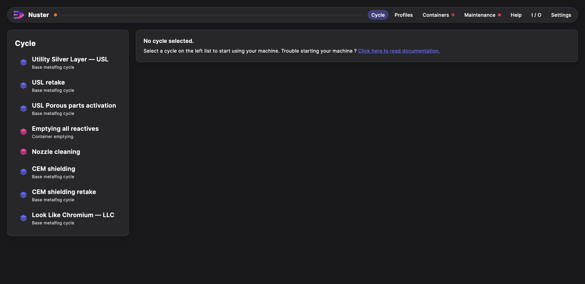

# @nuster/desktop

Interact with `@nuster/turbine`.

## Environment variables

Use the environment variables to connect to turbine.

| Environement variable name | value expected | Default value    | Description                        |
| -------------------------- | -------------- | ---------------- | ---------------------------------- |
| TURBINE_ADDRESS            | `host:port`    | `localhost:4080` | Turbine api address                |
| TURBINE_WS_ADDRESS         | `host:port`    | `localhost:4080` | Turbine realtime websocket address |
| PORT                       | `number`       | `4081`           | Port on which app is served        |

## Getting Started

Use the docker image `nusterkit/ui` in yourt `docker-compose.yaml` file to connect to `nusterkit/turbine` docker image at `TURBINE_ADDRESS` address.
