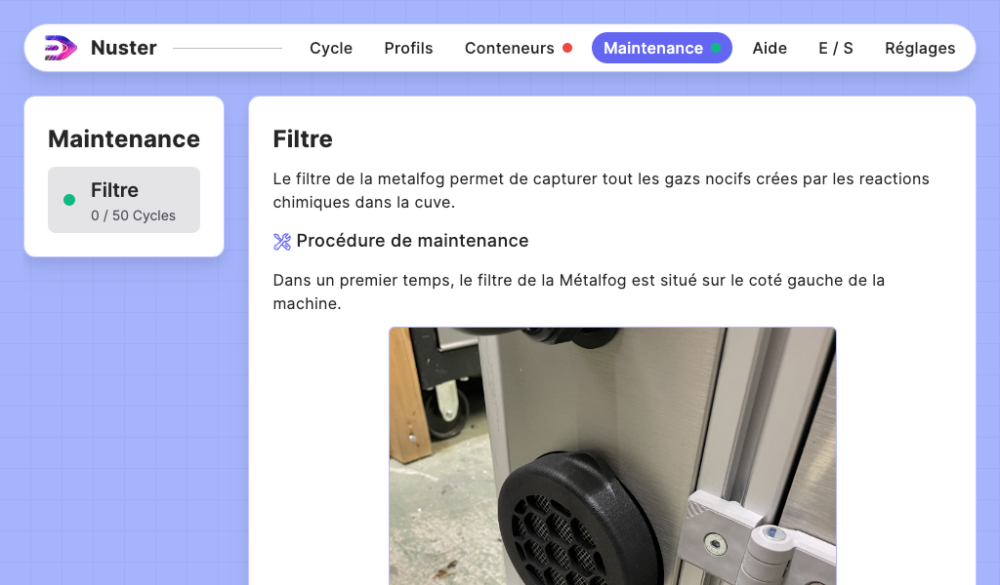
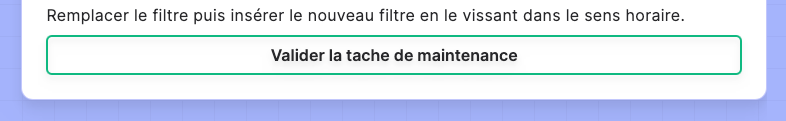

## Section — Maintenances

### Description générale - Onglet Maintenance

Cette section permet de gérer les tâches de maintenance de vos machines.

Chaque tâche de maintenance est disponible dans la liste de gauche. Son état est indiqué avec une pastille de couleur :

- **Vert** : la maintenance n'est pas à prévoir,
- **Orange** : la tâche de maintenance est à prévoir (> 75%),
- **Rouge** : la tâche de maintenance est à effectuer.

Cliquez sur une tâche pour afficher la procédure de maintenance à suivre.

### Procédure de maintenance

Chaque tâche de maintenance est accompagnée de sa procédure.

À la fin de la procédure de maintenance, vous trouverez le bouton de validation de la tâche qui remettra le compteur à 0.

### Avertissement : Maintenance rattachés à un capteur

Certaines tâches de maintenance sont assignées à la mesure d'un capteur.

>Exemple: Le filtre de l'USCleaner.

Le statut de cette tâche de maintenance dépend de l'état du capteur. Valider la tâche de maintenance sans avoir effectué le remplacement du filtre n'aura donc aucun effet sur son statut.
